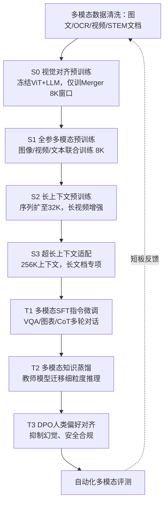

## 一、经典多模态模型简介（含 Qwen3-VL、LLaVA、BLIP-2、Flamingo、Gemini）
|模型|架构类型|核心桥接模块|定位特点|
| ---- | ---- | ---- | ---- |
|Qwen3-VL（阿里通义千问3多模态）|拼接式（ViT+MLP Merger+Qwen3 MoE LLM）|双层MLP Merger+DeepStack跨层融合，支持动态分辨率、256K超长上下文、视频/多图/文档OCR|开源最强国产多模态，超长图文视频理解，工业落地友好，分4段预训练+3段后训练|
|LLaVA（开源标杆）|极简拼接式（CLIP-ViT+单层线性投影+LLaMA/Vicuna）|单层MLP线性投影|轻量化、易复现、低成本复现，学术基线，仅两阶段基础训练|
|BLIP-2|拼接式（ViT+Q-Former+冻结LLM/T5）|Q-Former查询Transformer压缩视觉Token|零样本图文能力强，擅长图像检索、caption生成，解决视觉Token过长显存问题|
|Flamingo（DeepMind）|交叉注意力插入式（ViT+Perceiver重采样+LLM插入交叉注意力）|Perceiver Resampler+门控交叉注意力|原生支持多图、长视频，适合时序视觉推理|
|Gemini（Google）|原生统一多模态|无独立桥接，图像Patch/文本Token共享一套Transformer|端到端统一预训练，图文音视频平等建模，最强原生多模态推理能力，闭源超大算力训练|

<!--more-->

## Qwen3-VL 完整训练流程图（四阶段预训练+三阶段后训练）
### 文字流程链路
数据预处理（67B图文+OCR+视频+STEM文档清洗）
→ S0 视觉-语言基础对齐预训练
冻结ViT、冻结Qwen3 LLM，**仅训练MLP Merger**；损失：图文生成LM损失+ITC对比损失；序列长度8K
→ S1 全参数多模态联合预训练
ViT/Merger/LLM全部解冻，1T混合图文视频token；平衡图文loss权重；8K上下文
→ S2 长上下文预训练
序列扩至32K，增加长视频、长文档交错数据
→ S3 超长上下文适配
256K上下文窗口，长视频/多页文档专项数据微调
→ 后训练1：多模态SFT监督微调
高质量VQA、图表、多轮对话、CoT推理数据
→ 后训练2：教师模型知识蒸馏
强多模态模型蒸馏注入细粒度视觉推理能力
→ 后训练3：DPO偏好对齐
人类图文偏好排序数据，降低幻觉、规范输出、安全对齐
→ 多维度评测（MMBench/ChartQA/OCR/视频基准）→ 迭代补数据重训

### Mermaid流程图代码（可复制渲染）

## 多模态大模型完整训练全流程（表格汇总版）
## 一、整体训练四阶段总览表
|训练阶段|核心目标|可训练模块|冻结模块|核心数据|主损失函数|产出效果|
| ---- | ---- | ---- | ---- | ---- | ---- | ---- |
|1.跨模态预训练|打通图像/视频与文本语义空间，基础图文匹配|仅Projector/Q-Former|ViT视觉编码器、LLM主干|亿级粗图文对（LAION、CC3M）|图文生成LM损失+ITC对比损失|能看图生成简单描述，无法处理复杂问答指令|
|2.多模态指令微调|适配人类图文指令，完成VQA、OCR、图表、多轮对话|方案1：Projector+LoRA 方案2：Projector+LLM顶层少量层 方案3：全参微调（超大算力）|ViT/大部分LLM层（方案1/2）|10w~100w高质量图文指令样本|自回归文本LM损失（仅监督回答部分）|可完成各类视觉问答、图文对话，存在幻觉、回答不贴合人类习惯|
|3.人类偏好对齐（DPO/RLHF）|减少幻觉、规范输出风格、符合人类偏好、安全约束|投影层+LLM（LoRA优先）|ViT（多数场景）|图文问答偏好排序样本、安全负样本|DPO偏好损失 / PPO强化损失（RLHF）|回答准确简洁、幻觉大幅降低、输出合规友好|
|4.专项迭代/蒸馏|补齐短板、轻量化落地|小模型全量/LoRA|大教师模型冻结|短板专项数据（图纸/医学/数学图表）|蒸馏MSE损失+LM损失|轻量化可部署，专项场景精度提升|

## 二、模型四大基础模块功能&训练策略表
|模块名称|作用|常规训练冻结规则|特殊场景解冻策略|
| ---- | ---- | ---- | ---- |
|模态编码器（ViT/AudioEncoder）|图像、音频、视频转特征向量|预训练、微调阶段默认冻结|原生统一架构（Gemini/GPT4V）全程解冻；专业医疗/工业场景微调解冻少量层|
|桥接投影器（Projector/Q-Former/Resampler）|视觉特征映射至LLM词嵌入维度，压缩视觉token|全程可训练，所有阶段必更新|无冻结情况，是跨模态对齐核心训练单元|
|LLM文本主干|文本理解、逻辑推理、文字生成输出|预训练全冻结；指令微调仅解冻顶层几层/用LoRA|超大算力集群全参微调；蒸馏时冻结教师LLM|
|输出词头|文本token预测分类头|跟随LLM同步冻结/解冻|极少单独训练|

## 三、两类主流训练架构方案对比表
|方案类型|代表模型|架构特点|训练成本|优势|短板|
| ---- | ---- | ---- | ---- | ---- | ---- |
|拼接式（LLM+视觉编码器）|LLaVA、Qwen-VL、BLIP-2|预训练视觉模型+预训练文本大模型，中间加投影层桥接|低、中小集群可跑|开源易复现、算力需求低、迭代灵活|模态存在语义鸿沟，细粒度推理弱，易产生幻觉|
|原生统一多模态架构|GPT-4V、Gemini|图像patch、文本token共享一套Transformer主干，无独立投影层|极高，超大规模算力集群|跨模态深度融合，复杂推理、细粒度识别更强|训练门槛极高，闭源、成本昂贵，难以复现|

## 四、主流训练损失函数用途表
|损失名称|适用阶段|核心作用|
| ---- | ---- | ---- |
|ITC图文对比损失|预训练|批次内拉近匹配图文特征，推开无关图文，建立全局对齐|
|LM自回归生成损失|预训练+指令微调|监督模型根据图像输入生成匹配文字描述/问答回复|
|ITM图文匹配损失|预训练|二分类判断图文是否匹配，辅助对齐|
|MIM掩码图像建模损失|预训练|修复遮挡图像，强化视觉表征能力（可选）|
|DPO直接偏好损失|对齐阶段|利用人工排序数据优化回答，无需单独训练奖励模型|
|PPO强化损失（RLHF）|对齐阶段|依靠奖励模型反馈，优化模型输出质量|
|知识蒸馏MSE损失|模型蒸馏|让小模型拟合大模型多模态特征输出|

## 五、训练工程常见问题&解决方案对照表
|训练痛点|成因|标准解决手段|
| ---- | ---- | ---- |
|模态梯度震荡，Loss不收敛|视觉与文本梯度幅值差异大|冻结主干模型、分层差异化学习率、梯度裁剪|
|视觉Token过多，显存不足|单图Patch数量巨大|Q-Former/Resampler压缩视觉token、梯度累积、LoRA微调|
|模型频繁产生图文幻觉|跨模态对齐不足、指令数据单一|扩充预训练图文数据、DPO/RLHF约束、添加POPE负样本训练|
|微调算力开销过大|全参数更新参数量庞大|冻结编码器、仅训练投影层、LoRA低秩适配器|
|专项场景精度差（图纸/医疗）|通用图文数据覆盖不足|补充行业专属多模态数据，专项微调迭代|
